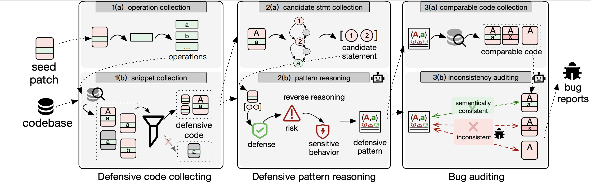

# BugAuditor

BugAuditor is an LLM-driven bug detection framework that uses inconsistent defensive handling as a new oracle for detecting project-specific bugs. Its key insight is that large software systems already contain abundant defensive code, where developers apply defensive operations to prevent bugs in security-sensitive contexts. When similar security-sensitive behaviors are handled defensively in some places but not in others, the inconsistency may indicate a real bug. 


BugAuditor first identifies defensive code snippets across the codebase, then infers defensive patterns that capture both the security-sensitive behavior and the required defensive handling. It finally applies these patterns to audit similar code contexts and detect missing or inconsistent handling.


The paper is included at [paper/BugAuditor.pdf](paper/BugAuditor.pdf). 

## Overview

<p align="center"></p>

## Structure

```text
BugAuditor
├── scripts/core/      # main pipeline entry points
├── prompts/           # prompts used by the pipeline
├── config.json        # source paths and LLM settings
├── artifact/          # AE scripts and reference data
├── src/utils/         # parser, CFG, Joern, and Weggli helpers
├── paper/             # paper PDF
├── INSTALL.md
└── AE.md
```


## Install

Please refer to [INSTALL.md](INSTALL.md).

## Artifact Evaluation

Please refer to [AE.md](AE.md) for instructions.

